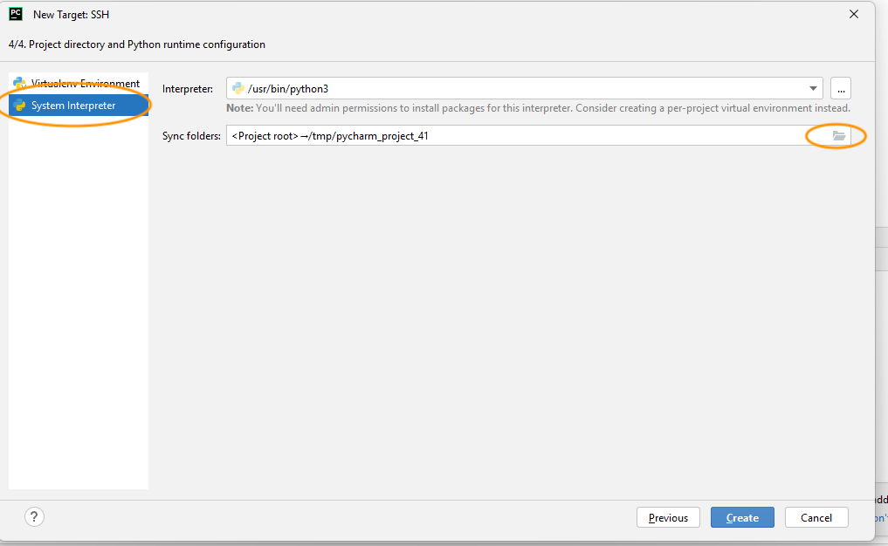
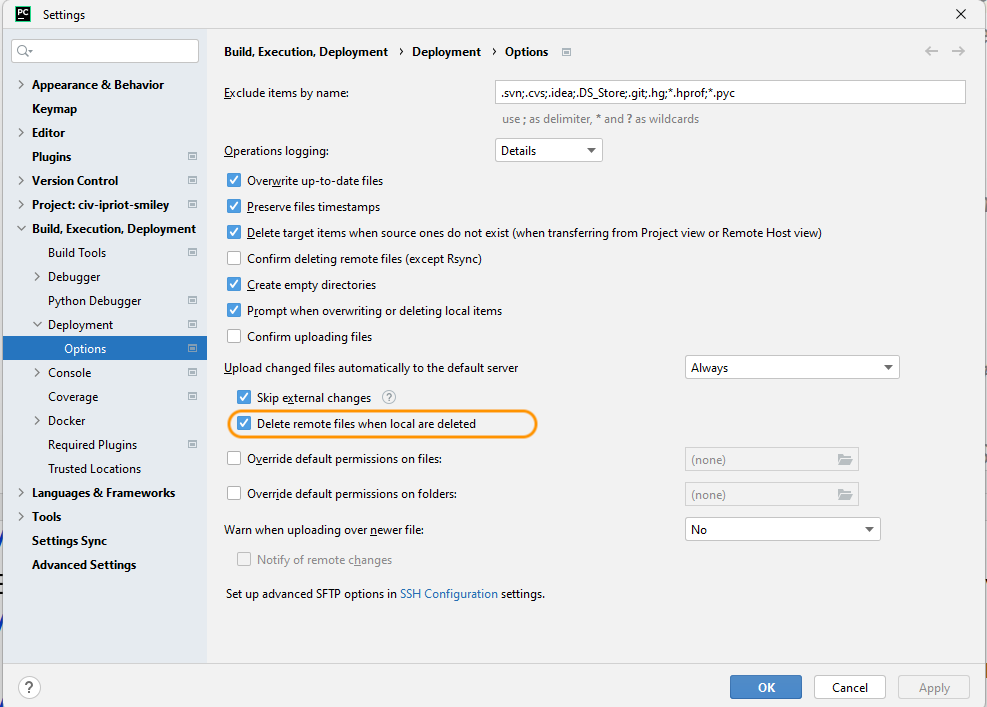

# Deploying and running the code from Pycharm

These instructions cover how to deploy the code from Pycharm on Windows to a connected Raspberry pi. 

> **⚠️ Note:** These instructions are specific to North Metro TAFE, TDM-networked Raspberry pi's

The instructions assume that:

- You have already cloned this repository
- You have set up your Raspberry PI and confirmed you can access it via the TDM network

## General overview

Pycharm integrates with `ssh` and `sftp` to provide the following:

- With `ssh`: Run code on a remote machine using its Python interpreter.
- With `sftp`: Synchronize the files on your local machine with those on the remote machine so when you run code remotely it is in sync with the local source.

If you have never worked in a remote environment before note this workflow (which is general):

1. Edit **locally**
2. Deploy **remotely** via a secure file transfer mechanism
3. Use a secure shell (SSH) to run the code on the remote machine

These instructions cover the following steps:

1. Setting up a remote interpreter in pycharm
2. Synchronizing a local folder with a folder on a remote machine
3. Optimizing the configuration
4. Executing code on the remote machine

## Adding a remote interpreter (Raspberry PI)

### Quick summary for experts

#### Required settings {#settings}

| Attribute         | Value                            | Notes                                                           |
| ----------------- | -------------------------------- | --------------------------------------------------------------- |
| hostname          | `pi-XX.local`                      | where `XX` represent the second and third digits on your pi       |
| username          | `pi`                               | default username on the pi                                      |
| password          | `Pi3.14`                           | note the uppercase `P`                                            |
| port              | `22`                               | default                                                         |
| mapped folder     | `/home/Documents/<username>/smiley` | Replace `<username>` with your Windows login name                    |
| python interpreter| `/usr/bin/python3`                 | you **must** use the system interpreter **not** a virtual environment |

#### Using SSH from the command line

```bash
ssh pi@pi-XX.local
```

Replace `XX` with the last two digits of your device ID. When you run this command, you will be prompted to enter the password for the `pi` user.

##### ⚠️ Notes: 

>- Be prepared, the password characters are not displayed on the screen
>- If you get a security warning, enter `yes` to continue

### Detailed instructions

**⚠️ Notes:**
>- This step assumes you have already cloned this repository. 
>- Pycharm offers excellent integration with GitHub but we want you to work with the command line as much as possible.


#### Open the project in pycharm

1. In Pycharm, select **File > Open...**, and then open the root folder of the repository (generally, `civ-ipriot-smiley`)
2. If you are prompted to create a venv, don't – if you've already created a venv, we recommend you *delete it*
3. In the pycharm navigation pane (default: left), delete the file named `sense_hat.py` and deselect the safe delete option.
(If you don't delete the `sense_hat.py`, it will shadow (replace) the **sense_hat** module that is already installed on the pi)

#### Add an SSH interpreter
1. From the bottom right, click the [Python Interpreter selector](https://www.jetbrains.com/help/pycharm/configuring-python-interpreter.html?keymap=primary_windows#widget), then:
**Add New Interpreter > On SSH** 
1. Enter the relevant settings and press **Next**. 
The following screenshots shows the appropriate [settings](#settings)


>**🛑 STOP 🛑**
Important steps ahead. Read *carefully*. 

3.  Select **System Interpreter**, and then confirm that the interpreter is set to `/usr/bin/python3`
4.  As shown in the following image, select the folder icon 🗁 to configure the **Sync folders**



5. Configure the remote folder to map to `/home/pi/Documents/<your_username>/source/smiley`. You may need to create new directories.
6. Only after you have performed these steps, press **Create**.

It may take a couple of minutes for your settings to synchronize for  the first time.

#### Optimize remote configuration

TODO: add detailed instructions



